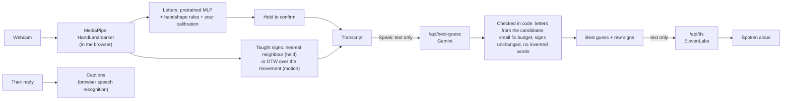

# Said With Hands

A communication aid for Deaf and hard-of-hearing people that runs in the browser. It recognizes ASL
fingerspelling and signs you teach it, turns them into a best-guess English sentence, says it out loud,
and captions the other person's reply. It is not an interpreter and doesn't translate ASL.

**Live:** https://saidwithhands.tech

## What it does

- **Fingerspelling, A to Z.** Hold a letter until the ring fills to type it. The 24 static letters come from
  a pretrained model refined with handshape rules; J and Z are motion signs drawn by the fingertip.
- **Teach a sign in about 20 seconds.** Record it 5 to 10 times and it is recognized right away, with no
  training step. Held handshapes and movements both work, and movements it wasn't taught are rejected instead
  of guessed. A Show button replays what you recorded in case you forget.
- **Built-in Space and Delete signs**, so you never have to reach for the keyboard.
- **Best guess.** On Speak, Google Gemini turns the recognized letters and signs into one natural sentence,
  putting back missing word breaks and fixing an occasional misread letter. It works out on its own whether the
  sentence is a question. The raw recognized signs are always shown underneath, and changed letters are marked.
- **Spoken aloud** with ElevenLabs, falling back to the browser's voice.
- **Their reply, captioned** with the browser's speech recognition.
- **Personal calibration.** About 40 seconds of recording, or just tap a wrong letter and pick the right
  one, and it learns your handshapes.

## How it works



- **Hand tracking** happens entirely on the device. Landmarks are normalized (wrist-centred, scaled, mirrored to a
  right hand), so left- and right-handed signers both work.
- **Taught signs** have per-sign rejection limits computed from your own examples. Held shapes are compared after
  lining up the hand's tilt (up to 25 degrees). Motion signs are matched with dynamic time warping by the shape of
  their path, searching each movement for the sign so a false start or a transition into it doesn't spoil it.
- **The best guess can't make things up.** The model only returns words; the server lines them up against the
  recognized letters and rejects the guess if it needs too many letter fixes, changes a taught sign, or adds
  content words that weren't signed. On any failure or timeout the raw signs are spoken instead.

## Privacy

- **No video leaves the device.** Only text is sent: the recognized signs to Google Gemini for the best guess,
  and the final sentence to ElevenLabs for the voice.
- **Reply captions use the browser's speech recognition.** In Chrome and Edge that sends the other person's audio
  to Google or Microsoft; the app says so on screen.
- **Taught signs and calibration stay in the browser** (IndexedDB). Export and Import move them between devices.

## Run it locally

Needs Node.js 20.9 or later (developed on Node 24).

```bash
npm install
cp .env.example .env.local   # then fill in the keys below
npm run dev                  # http://localhost:3000
```

| Variable | What it's for |
|---|---|
| `GEMINI_API_KEY` | Best guess (Google AI Studio key) |
| `GEMINI_MODEL` | Gemini model id, e.g. `gemini-3.5-flash-lite` |
| `ELEVENLABS_API_KEY` | Voice |
| `ELEVENLABS_VOICE_ID` | Which ElevenLabs voice to use |

Without keys the app still runs: Speak uses the raw recognized signs and the browser's voice. On Vercel, set the
same variables in the project settings.

## Checks and tools

| Command | What it does |
|---|---|
| `npm run check` | Typecheck, lint and unit tests (vitest) |
| `npm run build` | Production build |
| `npx tsx scripts/sim-teach.mts` | Simulates teaching and re-signing held signs (with jitter and tilt) |
| `npx tsx scripts/sim-motion.mts` | Same for motion signs, including false starts and signs back to back |
| `npx tsx --env-file=.env.local scripts/probe-gemini.mts 3` | Best-guess success rate on sample sentences, against the real Gemini |
| `npx tsx --env-file=.env.local scripts/probe-question.mts` | Checks that Gemini tells questions from statements |

## Project layout

| Path | Contents |
|---|---|
| `src/app/` | Pages (`/`, `/teach`, `/calibrate`, `/evaluate`) and the `best-guess` and `tts` API routes |
| `src/components/` | Camera, transcript, teach and calibrate screens, previews |
| `src/lib/` | Recognition: landmark features, letter model, rules, calibration, taught signs, DTW, segmentation, best-guess validation |
| `public/models/` | Hand-tracking model and letter model weights |
| `public/signs/starter.json` | Built-in signs (Space, Delete, J, Z) |
| `scripts/` | Simulations, probes and data tools |
